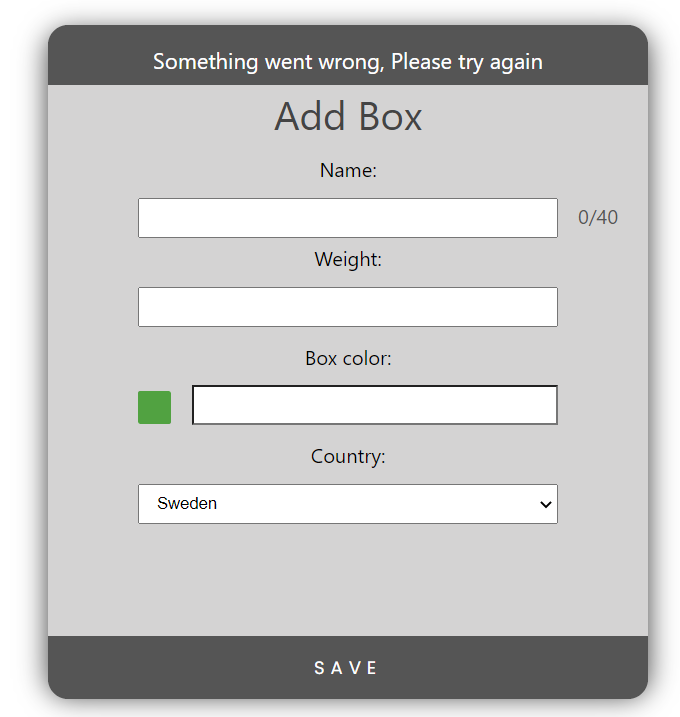

# Manual Test Cases

#### Test case 1.1, Submit form without any input

| Precondition | The application is online |
| --- | --- |
| **Manual test steps** | |
| Step 1 | Navigate to http://localhost:8080/#/addbox |
| Step 2 | Click the save/submit button on the form |

* Expected result/output: 

The user is presented with the string "Please fill in entire fom before submitting"

---

#### Test case 1.2, Enter invalid name input

| Precondition | The application is online |
| --- | --- |
| **Manual test steps** | |
| Step 1 | Navigate to http://localhost:8080/#/addbox |
| Step 2 | Enter an invalid input into "Name" (Ex. a text containing more than 40 characters) |

* Expected result/output: 

The user is presented with the string "Name is too long"

---

#### Test case 1.3, Enter negative weight input

| Precondition | The application is online |
| --- | --- |
| **Manual test steps** | |
| Step 1 | Navigate to http://localhost:8080/#/addbox |
| Step 2 | Enter a negative integer "Weight" (Ex. -10) |

* Expected result/output: 

The user is presented with the string "Negative values are not permitted"

---

#### Test case 1.4, Enter NaN weight input

| Precondition | The application is online |
| --- | --- |
| **Manual test steps** | |
| Step 1 | Navigate to http://localhost:8080/#/addbox |
| Step 2 | Enter a Not A Number into "Weight" (Ex. "2.") |

* Expected result/output: 

The user is presented with the string "Name is too long"

---

#### Test case 1.5, Open color picker

| Precondition | The application is online |
| --- | --- |
| **Manual test steps** | |
| Step 1 | Navigate to http://localhost:8080/#/addbox |
| Step 2 | Click the green box beside the box color input |

* Expected result/output: 

A color picker component is presented

---

#### Test case 1.6, Select box color

| Precondition | The user has opened the color picker |
| --- | --- |
| **Manual test steps** | |
| Step 1 | Select a color using the slider |
| Step 2 | Click "Save" |

* Expected result/output: 

The selected color is presented in the box input

---

#### Test case 1.7, Clear box color

| Precondition | The user has selected a box color |
| --- | --- |
| **Manual test steps** | |
| Step 1 | Open the color picker |
| Step 2 | Click "Clear" |

* Expected result/output: 

The previously selected color is now removed from the box input

---

#### Test case 1.8, Enter country input

| Precondition | The application is online |
| --- | --- |
| **Manual test steps** | |
| Step 1 | Navigate to http://localhost:8080/#/addbox |
| Step 2 | Click the select-input "Country" |
| Step 3 | Click on prefered country (Ex. "Brazil") |

* Expected result/output: 

The selected country is visible under "Country"

---

#### Test case 2.1, Submit form with valid input

| Precondition | The client & server-side is online |
| --- | --- |
| **Manual test steps** | |
| Step 1 | Navigate to http://localhost:8080/#/addbox |
| Step 2 | Enter a valid input into "Name" (Ex. "Test") |
| Step 3 | Enter a valid input into "Weight" (Ex. 12) |
| Step 4 | Use the "Color Picker" to enter a valid color |
| Step 5 | Enter a valid input into "Country" (Ex. "Brazil") |
| Step 6 | Click the save/submit button on the form |

* Expected result/output: 

The user is presented with the string "Box has been added"

---

#### Test case 2.2, Submit form with valid input but server offline

| Precondition | Only the client-side is online |
| --- | --- |
| **Manual test steps** | |
| Step 1 | Navigate to http://localhost:8080/#/addbox |
| Step 2 | Enter a valid input into "Name" (Ex. "Test") |
| Step 3 | Enter a valid input into "Weight" (Ex. 12) |
| Step 4 | Use the "Color Picker" to enter a valid color |
| Step 5 | Enter a valid input into "Country" (Ex. "Brazil") |
| Step 6 | Click the save/submit button on the form |

* Expected result/output: 

The user is presented with the string "Something went wrong, Please try again"

---