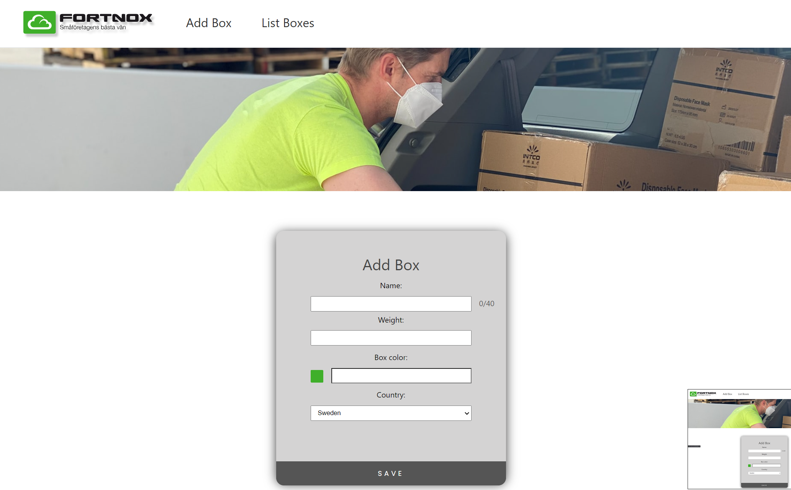

# Code-trial Fortnox

**Link to github repository:** <a href="https://github.com/HarryHagelberg404/code-trial">Code</a>

This artifact consist of how to start as well as how to test the application.

In the different artifacts below I list and elaborate about the challenges, solutions the assumptions I came across when developing this application. I have divided the application into three segments to more easily separate the different programming languages, techniques and practices required when creating the application. In the root directory you can find the different segments.

## Before starting the application

These requirements must be fulfilled:

- A MySQL database must exist
- The connection should be on port: 3306
- The password and username should be: "root" & "root"
- There should be a database with the name: "trial"

## Starting the application

Open a terminal and navigate to the application root directory. Then enter **exactly:**

```
start.bat
```

## Testing the application

Open a terminal and navigate to the application root directory. Then enter **exactly:**

```
test.bat
```


