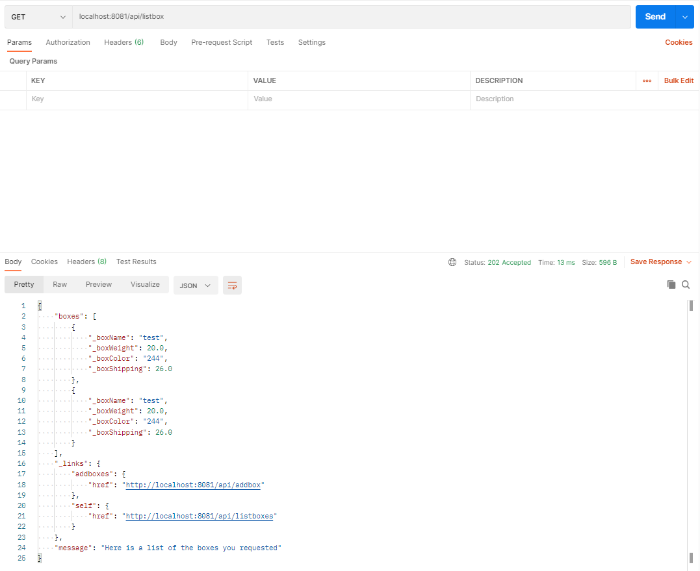

# Testing

Testing in general is an area im currently lacking at. The test effort in this application is obviously not acceptable for a real application (especially in the frontend area). I ran into some problems with the frontend test effort which I will ellaborate further about down below.

#### Postman

When making requests to the backend I followed the RESTful-principles. Here is screenshots of how the data is presented when a request is made.

##### Valid box insertion:

---

##### Invalid box insertion:

---

##### Valid list boxes request:

---

#### JUnit

I decided to not construct any tests for the listController class as all it does is recieve a GET request and then makes other method calls. A better solution is to make the test using Postman and test the methods in question separetely.

Most of the tests is self explanatory and checks both valid and invalid input.

#### Enzyme

If I were to recieve more time with this assignment I would modularize the both methods for making the backend API request to increase both modularity and testability.

**Why the test effort is insufficient**
When i tried rendering the **FormView** jest complained about that **useEffect** wasnt necessary in the test environment. I couldn't resolve this issue with enzyme which lead to that the following components wasn't tested:
* FormView
* Every Input Component

As i talked upon earlier, my testing effort is not sufficient. Errors occur, issues surface and when testing this application I was unfortunately not able to solve them. I'm aware that the score of the trial as well as the overall quality of this application is affected by this.
